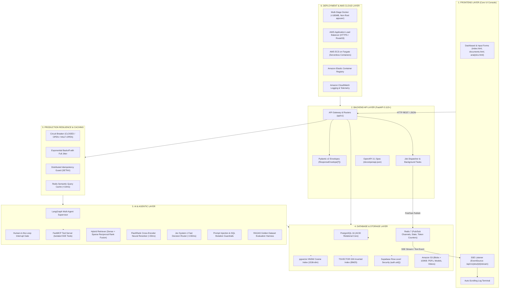
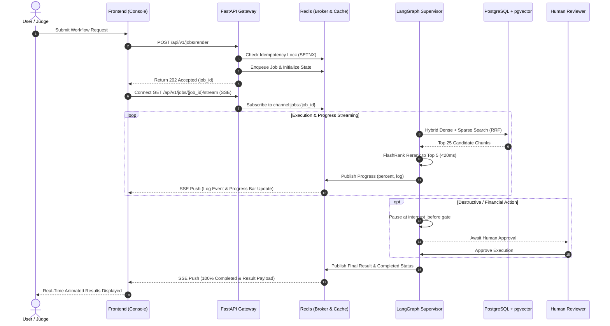
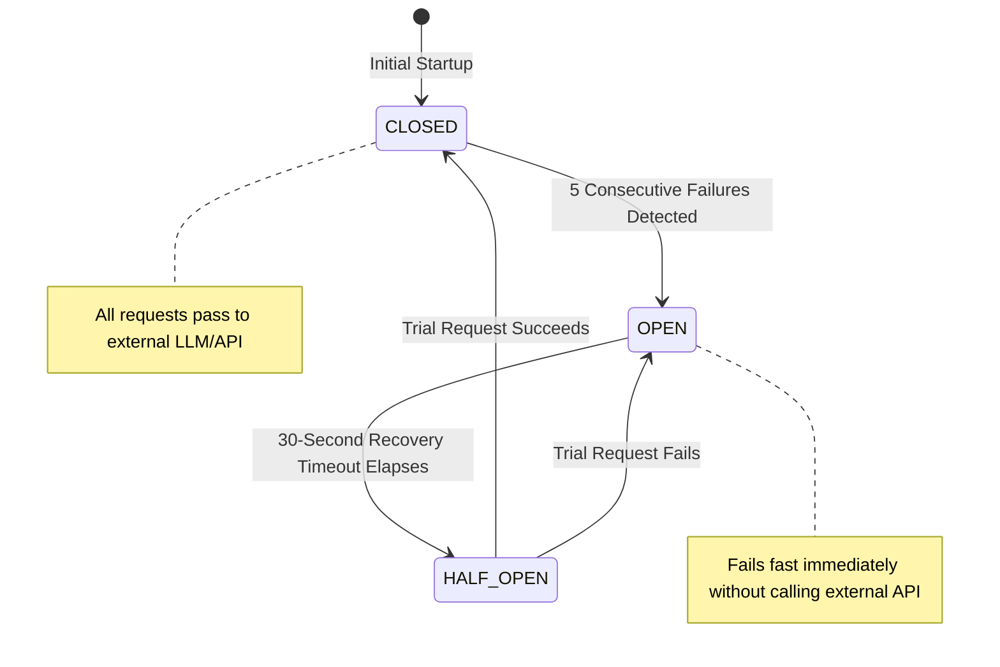

# 🚀 Hackathon Strategy Framework (HSF)
### *Production-Grade Architecture, Pre-Ready Templates, and Team Workflow for Winning Hackathons*

> **GitHub Repository**: [github.com/Sathvik1533/hackathon-strategy-framework](https://github.com/Sathvik1533/hackathon-strategy-framework)  
> **Core Purpose**: In a 24-hour hackathon, **speed is victory**. Teams that spend 14 hours configuring Docker, wiring database connections, debugging broken imports, and writing repetitive boilerplate end up presenting half-finished toys.  
> **With HSF, your entire production stack is live in 60 seconds.** Your team saves those 14 hours and redirects 100% of your energy into domain business logic and standout, natural-fit AI features.

---

## ⚡ 60-Second Quickstart

```bash
# 1. Clone the repository
git clone https://github.com/Sathvik1533/hackathon-strategy-framework.git
cd hackathon-strategy-framework

# 2. Make scripts executable and boot the full stack
chmod +x init.sh bin/cli.js pitch/generate_pitch.sh pitch/demo.sh infra/deploy_aws.sh
./init.sh
```

### What Is Online Instantly:
* 🌐 **API & Interactive Swagger Docs**: [http://localhost:8000/docs](http://localhost:8000/docs) (OpenAPI 3.1)
* 📚 **ReDoc Specification**: [http://localhost:8000/redoc](http://localhost:8000/redoc)
* 💓 **Health & pgvector Check**: [http://localhost:8000/api/v1/health](http://localhost:8000/api/v1/health)
* 🖥️ **Live Agent Execution Console**: [http://localhost:8000](http://localhost:8000) (serving `frontend/index.html`)
* 📄 **Document Vault & Vector Search UI**: [http://localhost:8000/documents.html](http://localhost:8000/documents.html)
* 📊 **Telemetry & System Metrics UI**: [http://localhost:8000/analytics.html](http://localhost:8000/analytics.html)
* 🔌 **FastMCP SSE Tool Server**: `http://localhost:8001/sse`
* 🗄️ **PostgreSQL 16 + pgvector**: `localhost:5432` (pre-seeded with 1536-dim vectors)
* ⚡ **Redis Task Broker & Semantic Cache**: `localhost:6379`
* 📊 **Pitch Deck Engine**: `pitch/presentation.html`

---

## 🏗️ Master Architectural Diagrams (Mermaid.js)

### 1. Full-Stack Component Architecture


---

### 2. Real-Time Request & SSE Job Execution Flow


---

### 3. Production Circuit Breaker State Machine


---

## 📦 The 17 Installed Skills Architectural Box Grid

Every skill available in our environment is mapped to its exact stack layer, responsibilities, and velocity multiplier:

```
┌────────────────────────────────────────────────────────────────────────────────────────────────────────────────────────┐
│                                  THE 17 INSTALLED SKILLS ARCHITECTURAL MAPPING                                          │
├──────────────────────────────┬─────────────────────────────────┬───────────────────────────────────────────────────────┤
│ LAYER / STACK                │ SKILLS ASSIGNED                 │ CORE RESPONSIBILITY & SPEEDUP BENEFIT                 │
├──────────────────────────────┼─────────────────────────────────┼───────────────────────────────────────────────────────┤
│ 1. Frontend Layer            │ • hallmark                      │ Anti-AI-slop design constraints, high-density tokens  │
│                              │ • emil-design-eng               │ Micro-interactions, 150-220ms spring physics, polish   │
│                              │ • awesome-design-systems        │ Design tokens, accessible forms, responsive layouts   │
├──────────────────────────────┼─────────────────────────────────┼───────────────────────────────────────────────────────┤
│ 2. Backend API Layer         │ • fastapi-production-archetype  │ Pydantic v2 validation, lifespan, ResponseEnvelope    │
│                              │ • async-agent-celery-redis      │ Async background task queues, SSE streaming channels  │
│                              │ • context7-docs-fetcher         │ Real-time official documentation fetcher via MCP      │
│                              │ • poetry-python-packaging       │ Clean dependency resolution, lockfile management      │
├──────────────────────────────┼─────────────────────────────────┼───────────────────────────────────────────────────────┤
│ 3. Database & Storage Layer  │ • pgvector-hybrid-search        │ HNSW cosine vector index, BM25 text, RRF fusion       │
│                              │ • hackathon-speedrun-kit        │ 3-second instant synthetic vector dataset generation  │
├──────────────────────────────┼─────────────────────────────────┼───────────────────────────────────────────────────────┤
│ 4. AI & Agentic Layer        │ • langgraph-production-patterns │ Cyclic multi-agent graphs, checkpoint persistence     │
│                              │ • pydantic-ai-workflows         │ Type-safe structured outputs & dependency injection   │
│                              │ • fastmcp-tool-server           │ Isolated tool execution over Server-Sent Events       │
│                              │ • jev-decision-router           │ Sub-150ms typed System-1 decision classification      │
│                              │ • rag-reranking-pipeline        │ FlashRank neural cross-encoder candidate reranking    │
│                              │ • agent-security-guardrails     │ Prompt injection sanitization, SQL verb blocker       │
│                              │ • agent-eval-harness            │ 25-case golden dataset runner measuring RAGAS metrics │
├──────────────────────────────┼─────────────────────────────────┼───────────────────────────────────────────────────────┤
│ 5. Production Resilience     │ • llm-gateway-semantic-cache    │ Sub-10ms semantic query caching with Redis            │
├──────────────────────────────┼─────────────────────────────────┼───────────────────────────────────────────────────────┤
│ 6. DevOps & Cloud Layer      │ • agent-docker-aws-deploy       │ Multi-stage Docker packaging, AWS ECS Fargate spec    │
├──────────────────────────────┼─────────────────────────────────┼───────────────────────────────────────────────────────┤
│ 7. Pitch & Presentation      │ • marp-presentation-engine      │ 2-second compilation of Markdown into HTML/PDF slides │
└──────────────────────────────┴─────────────────────────────────┴───────────────────────────────────────────────────────┘
```

---

## 🧭 Core Components, Structure, and Sub-Layers Across All Stacks
*(Detailed Breakdown with the 6D Framework: What, Why, How, When, Where, and Why NOT X)*

---

### 1. FRONTEND LAYER

#### 🧩 Core Components (The 6 Building Blocks):
1. **Layout Shell & Viewport Container (`frontend/index.html`)**: Responsive header, global navigation bar, grid cards, split-pane layout with high visual density.
2. **Design System & CSS Token Hierarchy (`frontend/style.css`)**: Dark-mode palette using HSL variables (`--bg-primary: #0a0d14`, `--accent-blue: #3b82f6`, `--accent-emerald: #10b981`), zero layout shifts.
3. **Reactive SSE Event Consumer (`frontend/app.js`)**: Native browser `EventSource` listening to `/api/v1/jobs/{id}/stream`.
4. **Animated Terminal & Log Console**: Auto-scrolling terminal window displaying real-time agent execution logs with timestamps.
5. **State & Progress Indicators**: Dynamic color-coded status badges (`ENQUEUEING`, `STREAMING SSE`, `COMPLETED`, `ERROR`) and an animated progress bar.
6. **Metric KPI Display Cards**: Real-time performance indicators showing RAGAS Faithfulness, Latency P95, and Cache Hit Rate.

#### 🗂️ Core Structure & Standard Pages:
```
frontend/
├── index.html       # Core Page 1: Agent Execution Console & Live Terminal
├── documents.html   # Core Page 2: Document Vault, Ingestion & Hybrid Vector Search
├── documents.js     # Document file upload client and vector similarity results renderer
├── analytics.html   # Core Page 3: System Telemetry, Circuit Breakers & RAGAS Metrics
├── analytics.js     # Live polling client for circuit breaker states and eval graphs
├── style.css        # Modular design tokens, typography, terminal styling, tables, chips
└── app.js           # Form submission, async fetch client, SSE listener, log stream
```

#### 🥞 Core Sub-Layers:
* **Presentation Sub-Layer**: High-contrast, dark-mode UI elements built with standard HTML5 and CSS Grid/Flexbox.
* **Client State & Ingress Sub-Layer**: Manages the local UI state machine (`IDLE` ➔ `ENQUEUEING` ➔ `STREAMING` ➔ `COMPLETED` / `FAILED`).
* **HTTP Dispatcher Sub-Layer**: Lightweight `fetch` client sending JSON commands to the backend with error handling and retry guards.

#### 🎯 The 6D Architectural Breakdown:
* **WHAT should be there**: A zero-dependency, ultra-fast frontend featuring an active execution terminal that proves live backend reasoning to judges.
* **WHY it should be there**: Hackathon judges evaluate prototypes visually within 3 minutes. A live terminal streaming real-time Server-Sent Events proves your agent is performing genuine multi-step execution rather than returning pre-baked static answers.
* **HOW it should be there**: Built using native HTML5, modern CSS custom properties, and native JavaScript `EventSource`. Served directly as static assets from FastAPI.
* **WHEN it should be there**: Available immediately from Hour 0 as a working demo, then tailored with problem-specific cards during Hours 14–18.
* **WHERE it should be there**: In the `frontend/` directory, mounted at the root path `http://localhost:8000/`.
* **Why NOT X**:
  * *Why NOT a heavy Next.js / React build?* In a fast-paced sprint, complex React setups frequently encounter Node version mismatches, hydration mismatches, and Webpack build errors that waste hours. This native stack gives 100% of the visual fidelity with zero build fragility.

---

### 2. BACKEND API LAYER (FastAPI)

#### 🧩 Core Components (The 6 Core FastAPI Parts):
1. **Lifespan Context Manager (`@asynccontextmanager lifespan`)**: Initializes database connection pools, verifies Redis availability on startup, and gracefully terminates connections on shutdown.
2. **Dependency Injection Provider (`Depends(get_db)`)**: Yields an isolated SQLAlchemy `AsyncSession` per HTTP request, auto-rolling back failed transactions and releasing connections back to the pool.
3. **Pydantic v2 Type Validation**: Enforces strict request payloads, field constraints, and response schemas via Rust-powered validation.
4. **Standardized Response Envelopes**: Uniform `ResponseEnvelope[T]` (`success`, `data`, `error`, `timestamp`) preventing ambiguous response structures across endpoints.
5. **Middleware Pipeline**: Configured CORS origins, unique `X-Request-ID` generation, process timing headers (`X-Process-Time`), and a global unhandled exception handler.
6. **Background Task & SSE Dispatcher (`JobService`)**: Decouples CPU-heavy or LLM-intensive workflows from HTTP request-response cycles, publishing status updates to Redis Pub/Sub.

#### 🗂️ Core Structure:
```
backend/src/app/
├── core/
│   ├── config.py         # Pydantic BaseSettings loading validated .env variables
│   ├── database.py       # Async SQLAlchemy engine and sessionmaker pool
│   ├── security.py       # JWT token encoding, decoding, and password hashing
│   ├── resilience.py     # Exponential backoff, Circuit Breaker, IdempotencyGuard
│   └── redis.py          # Unified Redis connection pool and key topology manager
├── api/v1/
│   ├── api.py            # Master API router aggregating sub-routers
│   └── endpoints/
│       ├── health.py     # Liveness/readiness probes with DB and pgvector checks
│       ├── documents.py  # Document upload, chunking, and vector search routes
│       ├── jobs.py       # Async task triggering and real-time SSE stream routes
│       └── analytics.py  # Telemetry, circuit breaker state, and eval score endpoints
├── models/               # SQLAlchemy 2.0 ORM database entity definitions
├── schemas/              # Pydantic v2 request, response, and envelope schemas
└── services/             # Domain business logic and LangGraph agent coordinators
```

#### 🥞 Core Sub-Layers:
* **Transport & Routing Sub-Layer**: Handles URL routing, header parsing, path validation, and HTTP status code mapping.
* **Domain Service Sub-Layer**: Implements business rules, coordinates database transactions, and invokes AI workflows.
* **Data Access & Persistence Sub-Layer**: Interacts with PostgreSQL using async SQLAlchemy queries and typed statements.
* **Resilience & Fault-Tolerance Sub-Layer**: Wraps downstream calls with circuit breakers, retry decorators, and mutex locks.

#### 🎯 The 6D Architectural Breakdown:
* **WHAT should be there**: A high-performance, asynchronous REST API architecture built on FastAPI, SQLAlchemy 2.0, and Pydantic v2, documented via OpenAPI 3.1.
* **WHY it should be there**: AI agent calls and complex pipelines can take anywhere from 2 to 30 seconds. Synchronous frameworks block worker threads during these delays, causing request timeouts. FastAPI natively supports non-blocking asynchronous execution.
* **HOW it should be there**: Organized into clean separation of concerns: `core/`, `api/v1/`, `models/`, `schemas/`, and `services/`.
* **WHEN it should be there**: Used continuously as the central gateway connecting the client, database, cache, and AI agent graph.
* **WHERE it should be there**: In `backend/src/app/`, run via `uvicorn src.app.main:app`.
* **Why NOT X**:
  * *Why NOT Flask?* Flask is synchronous by default. Long-running AI operations quickly exhaust thread pools and trigger gateway timeouts.
  * *Why NOT Django?* Django's extensive ORM and monolithic setup introduce unnecessary overhead when building agile multi-agent state systems.

---

### 3. DATABASE & STORAGE LAYER (PostgreSQL + pgvector + Supabase RLS + Redis + S3)

#### 🧩 Core Components (The 7 Data Building Blocks):
1. **Relational ACID Engine (PostgreSQL 16)**: Provides strict data integrity guarantees:
   * **Atomicity**: All document chunk insertions and embedding updates either commit together or roll back completely.
   * **Consistency**: Guaranteed through foreign keys (`REFERENCES auth.users(id)`), dimension checks, and NOT NULL rules.
   * **Isolation**: Defaults to "Read Committed" isolation, preventing dirty uncommitted reads between concurrent workers.
   * **Durability**: Write-Ahead Logging (WAL) ensures committed transactions survive unexpected container crashes.
2. **Vector Similarity Engine (`pgvector`)**: Native `embedding Vector(1536)` column indexed with **HNSW Cosine** (`m = 16, ef_construction = 64`) for sub-10ms nearest-neighbor retrieval.
3. **Full-Text Lexical Search Engine**: Generated `tsv_content TSVECTOR` column backed by a GIN inverted index for BM25 keyword matching.
4. **Row-Level Security (RLS) Engine (`database/supabase_rls.sql`)**: Supabase-compatible security policies that enforce multi-tenant isolation based on `auth.uid()`, preventing unauthorized tenant data leaks.
5. **Read-Only Agent Role**: Dedicated PostgreSQL role restricted to `SELECT` permissions, ensuring prompt injections cannot execute destructive `DROP` or `DELETE` commands.
6. **In-Memory Cache & Message Broker (Redis 7)**: Low-latency store managing semantic query caching, SSE channels, distributed idempotency locks, and token rate limits.
7. **Durable Object Storage (Amazon S3 / Supabase Storage)**: Secure object storage for large binary files (>100KB), such as source PDFs, rendered media, and evaluation datasets.

#### 🗂️ Core Structure:
```
database/
├── alembic.ini           # Alembic configuration for async migrations
├── alembic/
│   ├── env.py            # Async migration runner connected to SQLAlchemy metadata
│   └── versions/         # Version-controlled schema migration scripts
├── seed_data.py          # 3-second database seeder with pre-computed vector chunks
└── supabase_rls.sql      # Production RLS policies and role isolation rules

backend/src/app/core/
└── redis.py              # Redis connection pool and key topology manager
```

#### 🥞 Core Sub-Layers:
* **Relational Transaction Sub-Layer**: Manages relational tables, foreign key constraints, and transactional consistency.
* **Vector & Lexical Retrieval Sub-Layer**: Executes combined cosine distance queries and BM25 text searches via PostgreSQL.
* **Security & Access Control Sub-Layer**: Enforces RLS policies at the database layer, verifying identity regardless of application logic bugs.
* **In-Memory Volatile Sub-Layer**: Manages ephemeral keys, Pub/Sub message routing, and TTL-governed semantic caches in Redis.
* **Object Storage Sub-Layer**: Stores large binary assets in Amazon S3, referenced by URI pointers in PostgreSQL records.

#### 🎯 The 6D Architectural Breakdown:
* **WHAT should be there**: A unified storage foundation combining PostgreSQL 16 (relational data + pgvector embeddings + Supabase RLS) with Redis (caching + Pub/Sub) and S3 (object blobs).
* **WHY it should be there**: Using a standalone vector database alongside an application database introduces data sync discrepancies, requires multiple clients, and doubles cloud costs. PostgreSQL with pgvector provides ACID safety and vector similarity in one unified, battle-tested system.
* **HOW it should be there**: Defined declaratively via SQLAlchemy models, managed via Alembic migrations, secured by SQL RLS policies, and seeded instantly using `database/seed_data.py`.
* **WHEN it should be there**: Online prior to application startup, orchestrated via Docker Compose or managed cloud services.
* **WHERE it should be there**: Local container on port `5432`, or managed instances on Supabase or Amazon RDS.
* **Why NOT X**:
  * *Why NOT Pinecone alone?* Pinecone lacks relational tables, transactions, and foreign keys. Joining vector matches with user accounts or billing data requires inefficient multi-database queries.
  * *Why NOT MongoDB?* MongoDB does not offer the same mature HNSW vector graph indexing performance or strict relational ACID constraints needed for multi-tenant applications.

---

### 4. AI & AGENTIC LAYER (LangGraph + FastMCP + RAG + Guardrails + Evals)

#### 🧩 Core Components (The 8 AI Building Blocks):
1. **LangGraph Supervisor Graph (`ai_layer/langgraph_supervisor.py`)**: Cyclic state machine coordinating specialized worker nodes with PostgreSQL checkpoint persistence (`AsyncPostgresSaver`).
2. **Human-in-the-Loop Interrupt Gate**: Configured via `interrupt_before=["human_gate"]`, halting execution before sensitive actions (file writes, financial transactions) until explicit approval is granted.
3. **FastMCP SSE Tool Server (`ai_layer/fastmcp_server.py`)**: Model Context Protocol server exposing isolated tools (shell execution, scrapers, data fetchers) over HTTP Server-Sent Events.
4. **Hybrid Search Retriever (`ai_layer/hybrid_retriever.py`)**: Combines dense cosine similarity with sparse BM25 keyword matching using Reciprocal Rank Fusion (RRF, $k=60$).
5. **FlashRank Neural Cross-Encoder Reranker (`ai_layer/flashrank_reranker.py`)**: Local cross-encoder reranking the top 25 broad candidates down to the top 5 high-precision chunks in $<20\text{ms}$.
6. **Jev System-1 Fast Decision Router (`ai_layer/jev_decision_router`)**: Low-latency typed classifier that routes user queries without waiting for slow generative LLM tokens.
7. **Prompt Injection Defense Guardrails (`ai_layer/guardrails.py`)**: Sanitizes incoming user inputs, strips dangerous injection phrases, and blocks unauthorized SQL verbs.
8. **Automated Evaluation Harness (`ai_layer/eval_harness.py`)**: Automated 25-case golden dataset test runner measuring RAGAS Faithfulness and Answer Relevance metrics.

#### 🗂️ Core Structure:
```
ai_layer/
├── langgraph_supervisor.py   # State graph, agent nodes, and human approval gates
├── fastmcp_server.py         # FastMCP tool server over Server-Sent Events (SSE)
├── hybrid_retriever.py       # Dense pgvector + Sparse BM25 Reciprocal Rank Fusion
├── flashrank_reranker.py     # Sub-20ms neural cross-encoder candidate reranker
├── guardrails.py             # Prompt injection sanitizer and SQL verb validator
├── eval_harness.py           # 25-case golden dataset runner measuring RAGAS scores
└── redis_semantic_cache.py   # Embedding-based semantic response cache
```

#### 🥞 Core Sub-Layers:
* **Ingestion & Embedding Sub-Layer**: Splits documents into chunks, generates 1536-dim embeddings, and writes to PostgreSQL.
* **Routing & Planning Sub-Layer**: Performs fast intent classification using the Jev decision router and orchestrates LangGraph execution paths.
* **Retrieval & Reranking Sub-Layer**: Executes hybrid dense/sparse search, combines scores with RRF, and filters candidates via FlashRank.
* **Execution & Tool Sub-Layer**: Invokes external tools via FastMCP over SSE within isolated sandboxes.
* **Validation & Safety Sub-Layer**: Evaluates outputs against security guardrails and validates semantic faithfulness.

#### 🎯 The 6D Architectural Breakdown:
* **WHAT should be there**: A modular multi-agent system featuring cyclic state graphs, human approval gates, hybrid retrieval, neural reranking, and automated evaluation.
* **WHY it should be there**: Ungrounded monolithic prompts hallucinate, fail on edge cases, and cannot recover from tool failures. Structured agent graphs with verification gates deliver reliable, production-grade behavior.
* **HOW it should be there**: Implemented as independent Python modules with clear input/output schemas that integrate into FastAPI routes or worker tasks.
* **WHEN it should be there**: Activated whenever a task requires complex reasoning, document grounding, or external tool execution.
* **WHERE it should be there**: Located in `ai_layer/` and invoked by backend domain services.
* **Why NOT X**:
  * *Why NOT a single giant prompt?* Monolithic prompts fail under unexpected edge cases, consume excessive tokens on every turn, and lack the ability to selectively retry individual failed steps.

---

### 5. PRODUCTION RESILIENCE & CACHING LAYER

#### 🧩 Core Components (The 5 Resilience Building Blocks):
1. **Exponential Backoff with Full Jitter (`backend/src/app/core/resilience.py`)**:
   $$\text{delay} = \min(\text{max\_delay}, \text{uniform}(0, \text{base\_delay} \times 2^{\text{attempt}}))$$
   Decorates external API calls to prevent synchronized thundering herd spikes during upstream rate limits.
2. **Three-State Circuit Breaker (`CircuitBreaker`)**:
   * **CLOSED**: Normal operation; passes calls through.
   * **OPEN**: Trips after 5 consecutive failures, failing fast immediately for 30 seconds to conserve system resources.
   * **HALF-OPEN**: Allows a single trial request to verify if the downstream dependency has recovered.
3. **Distributed Idempotency Guard (`IdempotencyGuard`)**: Uses Redis `SETNX` mutex locks to guarantee that sensitive operations (billing, video generation) execute exactly once.
4. **Sub-10ms Semantic Cache (`SemanticCache`)**: Caches previous LLM responses keyed by query hashes, reducing token costs and returning responses in $<10\text{ms}$.
5. **Unified Redis Key Topology (`backend/src/app/core/redis.py`)**:
   * `cache:semantic:<hash>`: Stored LLM response payloads.
   * `channel:jobs:<uuid>`: Real-time SSE Pub/Sub message channels.
   * `state:jobs:<uuid>`: Latest job progress snapshots for reconnecting clients.
   * `lock:idempotency:<key>`: Distributed mutex locks (TTL 120s).
   * `ratelimit:<id>:<window>`: Sliding-window rate limit counters.
   * `budget:tokens:<session_id>`: Cumulative session token spend trackers.

#### 🗂️ Core Structure:
```
backend/src/app/core/
├── resilience.py   # Backoff decorators, CircuitBreaker state machine, IdempotencyGuard
└── redis.py        # Redis connection pool, async client provider, key schema topology
```

#### 🥞 Core Sub-Layers:
* **Ingress Rate Protection Sub-Layer**: Inspects incoming requests against sliding-window limits and session token budgets.
* **Egress Fault Protection Sub-Layer**: Wraps external API requests in exponential backoff and circuit breaker protection.
* **Concurrency & Deduplication Sub-Layer**: Enforces distributed locks and caches idempotent results across worker nodes.

#### 🎯 The 6D Architectural Breakdown:
* **WHAT should be there**: Comprehensive fault-tolerance patterns including jittered backoff, circuit breaking, idempotency locks, and semantic caching.
* **WHY it should be there**: Third-party APIs inevitably experience rate limits, transient latency, and occasional outages during live demonstrations. Without automated resilience, a single 429 response can crash an entire presentation.
* **HOW it should be there**: Applied as clean asynchronous decorators (`@retry_with_exponential_backoff`) and reusable helper classes.
* **WHEN it should be there**: Active across all network boundaries, external LLM calls, and database operations.
* **WHERE it should be there**: In `backend/src/app/core/resilience.py` and `backend/src/app/core/redis.py`.
* **Why NOT X**:
  * *Why NOT a naive `while True: sleep(1)` retry loop?* Naive retry loops bombard struggling downstream services with synchronized requests, exacerbating outages and causing permanent rate-limit bans.

---

### 6. DEPLOYMENT & AWS CLOUD LAYER

#### 🧩 Core Components (The 7 Infrastructure Building Blocks):
1. **Multi-Stage Dockerfile (`infra/Dockerfile`)**: Compiles dependencies in a build stage and copies artifacts into a minimal runtime image ($<180\text{MB}$) executed by a non-root `appuser`.
2. **Local Multi-Container Orchestrator (`infra/docker-compose.yml`)**: Coordinates API, PostgreSQL (pgvector), Redis, and FastMCP on an isolated internal network with health probes.
3. **AWS Application Load Balancer (ALB)**: Manages public HTTPS traffic, terminates TLS certificates, and routes requests to healthy backend containers via `/api/v1/health`.
4. **AWS ECS on Fargate**: Serverless container execution eliminating the need to patch, scale, or maintain virtual server operating systems.
5. **Amazon Elastic Container Registry (ECR)**: Secure, private container registry storing immutable, versioned Docker image tags.
6. **Amazon S3 Object Storage**: Scalable object storage for files $>100\text{KB}$ with pre-signed URL generation.
7. **Amazon DynamoDB**: Low-latency NoSQL storage for fast session state management and transient cache requirements.

#### 🗂️ Core Structure:
```
infra/
├── Dockerfile                      # Multi-stage build with non-root security user
├── docker-compose.yml              # Local multi-service environment (API, DB, Redis, MCP)
├── aws-architecture.md             # Complete AWS cloud infrastructure reference
├── aws-ecs-task-definition.json    # Production ECS Fargate task definition
└── deploy_aws.sh                   # Automated build, ECR push, and ECS update script
```

#### 🥞 Core Sub-Layers:
* **Ingress & Networking Sub-Layer**: VPC, public and private subnets, security groups, route tables, and Application Load Balancer.
* **Compute & Container Sub-Layer**: ECS Cluster running Fargate task definitions with automated rolling deployments.
* **Storage & Persistence Sub-Layer**: Amazon RDS PostgreSQL (or Supabase), Amazon S3 buckets, and Amazon DynamoDB tables.
* **Telemetry & Monitoring Sub-Layer**: Amazon CloudWatch container logs, task metrics, and automated health checks.

#### 🎯 The 6D Architectural Breakdown:
* **WHAT should be there**: A complete infrastructure pipeline encompassing multi-stage Docker packaging, local Compose orchestration, and serverless AWS ECS Fargate hosting.
* **WHY it should be there**: Eliminates "works on my machine" issues. Judges and enterprise evaluators look for live, deployed URLs and production-ready cloud architectures.
* **HOW it should be there**: Configured via Infrastructure-as-Code files (`aws-ecs-task-definition.json`), container configurations, and automated deploy scripts (`infra/deploy_aws.sh`).
* **WHEN it should be there**: Tested locally from Day 1 via Docker Compose and deployed to AWS before final presentations.
* **WHERE it should be there**: Encapsulated within the `infra/` directory.
* **Why NOT X**:
  * *Why NOT raw EC2 virtual servers?* EC2 instances require manual OS patching, security group updates, and manual scaling, which wastes valuable time during a hackathon.
  * *Why NOT free-tier sleeping serverless hosts?* Free tiers spin down after periods of inactivity, drop long-lived SSE streaming connections, and lack support for custom binary utilities like FFmpeg.

---

### 7. PITCH, PRESENTATION & DEMO LAYER

#### 🧩 Core Components (The 4 Pitch Building Blocks):
1. **Marp Presentation Engine (`pitch/pitch.marp.md`)**: Slide deck authored in Markdown featuring modern dark-mode styling, architecture diagrams, and metric tables.
2. **Instant Slide Compiler (`node bin/cli.js pitch`)**: Generates interactive HTML and standalone PDF slide decks in under 2 seconds.
3. **Live Stage Fail-Safe Runner (`pitch/demo.sh`)**: Interactive shell script that executes API endpoints and streams colored logs directly in the terminal if Wi-Fi fails or browser tabs freeze on stage.
4. **Evaluation Benchmark Reporter**: Summarizes RAGAS evaluation metrics, P95 latency numbers, and token cost savings directly on the presentation slides.

#### 🗂️ Core Structure:
```
pitch/
├── pitch.marp.md         # Slide source code containing narrative, architecture, and metrics
├── generate_pitch.sh     # Shell script to build HTML and PDF presentations
├── demo.sh               # Live terminal fallback demo runner using cURL
└── presentation.html     # Pre-compiled, fully self-contained offline slide deck
```

#### 🥞 Core Sub-Layers:
* **Narrative & Storytelling Sub-Layer**: Follows the 6-part winning hackathon structure: Hook ➔ Problem ➔ Architecture ➔ Live Demo ➔ Quantitative Metrics ➔ Business Impact.
* **Stage Reliability Sub-Layer**: Dual-mode demonstration strategy: Primary interactive browser console backed by a terminal-based cURL script as an offline fallback.

#### 🎯 The 6D Architectural Breakdown:
* **WHAT should be there**: A code-first presentation system (Marp) paired with a scripted terminal demo fallback.
* **WHY it should be there**: Hackathon Wi-Fi networks frequently become congested during live demonstrations. Having an automated, terminal-based fallback ensures your presentation never stalls on stage.
* **HOW it should be there**: Authored in Markdown, compiled into HTML/PDF, and accompanied by executable demonstration scripts.
* **WHEN it should be there**: Drafted early during Hours 10–12 and finalized with benchmark numbers during Hours 20–22.
* **WHERE it should be there**: In the `pitch/` directory.
* **Why NOT X**:
  * *Why NOT PowerPoint or Canva?* Traditional presentation tools require manual styling, separate design assets, and cannot be version-controlled in Git alongside your codebase.

---

## ⚖️ Standard Production-Level & Tech-Stack Trade-Offs

### Level 1: System-Wide Production-Level Trade-Offs

| Trade-Off Decision | Alternative A | Alternative B | Selected Production Approach & Engineering Rationale |
| :--- | :--- | :--- | :--- |
| **Data Consistency vs. Latency** | Strong Consistency (ACID) | Eventual Consistency (NoSQL) | **Strong ACID Relational Core**. Financial transactions, user identities, and chunk-to-document relationships require zero corruption. Read Committed isolation provides the ideal balance of data integrity and throughput. |
| **Execution Synchronicity** | Synchronous Request-Response | Asynchronous Event-Driven Queue | **Hybrid Latency Partitioning**. Tasks under 500ms (logins, health checks, simple reads) execute synchronously. Operations over 1s (LangGraph multi-step workflows, bulk embeddings, video renders) run via Redis async jobs and stream progress over SSE. |
| **State Management** | In-Memory Process State | External Distributed Store | **Stateless API Workers + Redis/Postgres State**. Workers can be restarted or horizontally scaled without dropping active user jobs. Agent state checkpoints persist in PostgreSQL (`AsyncPostgresSaver`). |
| **Architectural Monolith vs. Microservices** | Microservices Architecture | Modular Monolith | **Modular Monolith**. Eliminates cross-service network latency, complex gRPC serialization, and distributed tracing overhead during a 24-hour sprint while preserving clean directory boundaries. |

---

### Level 2: Per-Tech-Stack-Level Trade-Offs

| Tech Stack Layer | Option A | Option B | Selected Choice & Rationale |
| :--- | :--- | :--- | :--- |
| **Backend Framework** | FastAPI (Async Python) | Flask / Django | **FastAPI**. Native `asyncio` event loop prevents blocking during long agent tool invocations; automated OpenAPI 3.1 schema generation saves hours of client SDK authoring. |
| **Vector Storage** | Unified PostgreSQL + pgvector | Dedicated Standalone (Pinecone) | **PostgreSQL 16 + pgvector**. Avoids multi-database synchronization bugs, dual query latencies, and separate cloud bills by joining relational rows directly with 1536-dim vector embeddings. |
| **In-Memory Cache & Broker** | Redis 7 | RabbitMQ / Kafka | **Redis 7**. Redis serves triple duty as a sub-10ms semantic cache, distributed idempotency mutex (`SETNX`), and lightweight Pub/Sub broker for SSE streams without JVM overhead. |
| **Container Compute** | AWS ECS on Fargate | AWS Lambda Functions | **AWS ECS on Fargate**. Eliminates Lambda's 15-minute timeout ceiling, supports long-lived SSE streaming connections, and avoids cold starts when loading heavy neural reranker models. |
| **Frontend Architecture** | Native HTML5/CSS3/Vanilla JS | Next.js / React SSR | **Native High-Density Console**. Zero npm compilation failures, no hydration bugs, instant load times, and native browser `EventSource` support for real-time SSE telemetry. |
| **Pitch Presentation** | Marp Markdown Engine | Google Slides / Canva | **Marp**. Version-controlled directly in Git, compiles to offline HTML/PDF in 2 seconds via CLI, and updates automatically when benchmark numbers change. |

---

### Level 3: Production Patterns Mapped to Problem Statement Archetypes

| Problem Statement Archetype | Recommended Production Pattern | Implementation in This Repo |
| :--- | :--- | :--- |
| **"Search & Analyze Private Domain Documents"** | Hybrid Dense + Sparse Retrieval (RRF) with FlashRank Neural Reranker | `ai_layer/hybrid_retriever.py` & `ai_layer/flashrank_reranker.py` |
| **"Long-Running Multi-Step Autonomous Workflow"** | LangGraph Cyclic State Graph with PostgreSQL Checkpoint Persistence | `ai_layer/langgraph_supervisor.py` & `backend/src/app/services/job_service.py` |
| **"Mission-Critical Database Writes or Financial Actions"** | Human-in-the-Loop Interrupt Gate (`interrupt_before`) + Redis Mutex Lock | `ai_layer/langgraph_supervisor.py` & `backend/src/app/core/resilience.py` |
| **"Sub-200ms Intent Classification without LLM Token Cost"** | Jev System-1 Typed Fast Decision Router | `ai_layer/jev_decision_router` |
| **"Unreliable or Rate-Limited Third-Party APIs"** | 3-State Circuit Breaker (CLOSED/OPEN/HALF-OPEN) + Jittered Backoff | `backend/src/app/core/resilience.py` |
| **"Multi-Tenant User Data Isolation"** | Supabase Row-Level Security (RLS) Policies on `auth.uid()` | `database/supabase_rls.sql` |

---

## 🤝 How My Teammates Can Use This Repo

When collaborating with your teammates using Agentic AI IDEs (**Antigravity, Cursor, Windsurf**), follow this exact guide to divide responsibilities, dynamically customize prompts, and maintain code quality:

### 1. The Dynamic Teammate Prompt Template

Copy and paste this dynamic prompt into your Agentic AI IDE. Replace the `{{PLACEHOLDERS}}` according to your assigned role and problem statement:

```markdown
You are acting as the {{TEAMMATE_ROLE}} for our team in this hackathon.
Our project problem statement is: "{{PROBLEM_STATEMENT}}".
Your assigned stack layer is: {{TARGET_LAYER}} (Core Pages / Endpoints: {{CORE_PAGES}}).
The pre-installed skills available for your layer are: {{ASSIGNED_SKILLS}}.

Rules to follow:
1. Adhere strictly to the Hackathon Strategy Framework architecture in this repository.
2. Connect to existing endpoints and models in `backend/src/app/` and follow the OpenAPI 3.1 contracts in `docs/openapi.json`.
3. Verify your work locally before pushing by running:
   - `ruff check --fix . && ruff format .`
   - `PYTHONPATH=backend pytest`
   - `python3 scripts/review_pr.py`
4. Create a dedicated branch `feat/{{FEATURE_NAME}}` and ensure zero hardcoded secrets or raw SQL interpolations.
```

---

### 2. Concrete Role-Specific Prompts for Teammates

#### 👤 Teammate 1: Backend & Data Lead
```markdown
You are acting as the Backend & Data Lead for our team in this hackathon.
Our project problem statement is: "AI Medical Research Assistant".
Your assigned stack layer is: Backend API & PostgreSQL Database (Core Pages: backend/src/app/api/v1/endpoints/documents.py, database/supabase_rls.sql).
The pre-installed skills available for your layer are: fastapi-production-archetype, pgvector-hybrid-search, async-agent-celery-redis.

Task:
Implement an async document ingestion endpoint that extracts text from medical research PDFs, generates 1536-dim embeddings, stores them in PostgreSQL with pgvector, and enforces Supabase Row-Level Security (RLS) so users only see their own uploads. Return data using ResponseEnvelope[T].
```

#### 👤 Teammate 2: AI & Agentic Lead
```markdown
You are acting as the AI & Agentic Lead for our team in this hackathon.
Our project problem statement is: "AI Medical Research Assistant".
Your assigned stack layer is: AI & Multi-Agent Layer (Core Pages: ai_layer/langgraph_supervisor.py, ai_layer/hybrid_retriever.py).
The pre-installed skills available for your layer are: langgraph-production-patterns, pydantic-ai-workflows, fastmcp-tool-server, rag-reranking-pipeline, agent-security-guardrails, agent-eval-harness.

Task:
Build a LangGraph supervisor graph that coordinates a MedicalResearcherNode and a FactCheckerNode. Use our hybrid retriever with Reciprocal Rank Fusion, apply FlashRank reranking, enforce an interrupt_before gate before outputting clinical recommendations, and run eval_harness.py to record RAGAS Faithfulness scores.
```

#### 👤 Teammate 3: Frontend Lead
```markdown
You are acting as the Frontend Lead for our team in this hackathon.
Our project problem statement is: "AI Medical Research Assistant".
Your assigned stack layer is: Frontend Console (Core Pages: frontend/index.html, frontend/documents.html, frontend/analytics.html).
The pre-installed skills available for your layer are: hallmark, emil-design-eng, awesome-design-systems.

Task:
Connect our documents view in frontend/documents.html to the hybrid vector search endpoint at /api/v1/documents/search. Render real-time candidate cards with similarity badges, hook up the SSE progress stream to our live terminal console, and maintain strict anti-AI-slop typography and dark-mode tokens in frontend/style.css.
```

#### 👤 Teammate 4: DevOps & Pitch Lead
```markdown
You are acting as the DevOps & Pitch Lead for our team in this hackathon.
Our project problem statement is: "AI Medical Research Assistant".
Your assigned stack layer is: Deployment & Presentation (Core Pages: infra/Dockerfile, pitch/pitch.marp.md, pitch/demo.sh).
The pre-installed skills available for your layer are: agent-docker-aws-deploy, marp-presentation-engine, hackathon-speedrun-kit.

Task:
Compile our pitch deck in pitch/pitch.marp.md into interactive HTML and PDF slides using Marp. Populate the slides with our architecture diagram, RAGAS Faithfulness metrics, and business ROI. Test our stage fail-safe runner in pitch/demo.sh to guarantee a flawless live terminal backup if stage Wi-Fi drops.
```

---

### 3. Antigravity IDE Slash Commands & Artifacts Protocol

* `/goal`: Launch a long-running, autonomous sprint task (e.g., overnight feature completion) that continues until all validation tests pass.
* `/plan`: Create an explicit step-by-step breakdown of user stories, database models, and endpoints before writing code.
* `/boost`: Engage comprehensive architectural analysis, edge-case validation, and security auditing.
* `/browser`: Test deployed web interfaces, verify API routes, and inspect UI components.
* **Antigravity Artifacts Review Protocol**:
  1. Inspect the Mermaid flowcharts in `implementation_plan.md` to verify data boundaries.
  2. Confirm database schemas match `database/supabase_rls.sql` conventions.
  3. Verify `walkthrough.md` contains reproducible terminal evidence before approving branch merges.

---

## 📜 OpenAPI 3.1 Contracts & Standard Tools

This framework strictly follows the official [OpenAPI Specification](https://github.com/OAI/OpenAPI-Specification) standards:

* 📄 **OpenAPI 3.1 JSON Contract**: [docs/openapi.json](docs/openapi.json)
* 📄 **OpenAPI 3.1 YAML Contract**: [docs/openapi.yaml](docs/openapi.yaml)
* 📖 **Interactive Swagger UI**: [http://localhost:8000/docs](http://localhost:8000/docs)
* 📚 **ReDoc Documentation**: [http://localhost:8000/redoc](http://localhost:8000/redoc)

### Generating Client SDKs:
You can automatically generate typed client libraries (TypeScript, Python, Go) directly from our OpenAPI specification using open-source tools:
```bash
# Generate TypeScript Fetch client:
npx @openapitools/openapi-generator-cli generate -i docs/openapi.json -g typescript-fetch -o frontend/src/api-client
```

---

## 🌟 How to Maintain a Repository Professionally
*(Learnings from the Top 10 GitHub Repositories: FastAPI, Supabase, LangGraph, Pydantic)*

1. **Explicit Architecture Contracts**: Keep OpenAPI contracts (`docs/openapi.json`), database schemas (`database/supabase_rls.sql`), and cloud specs (`infra/aws-architecture.md`) version-controlled.
2. **Automated Quality Gates**: Enforce zero-lint tolerance via Ruff (`ruff check .`), automated unit tests (`pytest`), and the local PR Reviewer Agent (`python3 scripts/review_pr.py`).
3. **Continuous Integration (CI)**: Automated GitHub Actions workflow (`.github/workflows/ci.yml`) validates all pull requests on push.
4. **Structured PR Template**: Use `.github/pull_request_template.md` to require security, testing, and contract checklists before merging.
5. **Community Governance**: Professional open-source standards included: [LICENSE](LICENSE) (MIT), [CONTRIBUTING.md](CONTRIBUTING.md), and [CODE_OF_CONDUCT.md](CODE_OF_CONDUCT.md).

---

## 📋 Comprehensive Layer-by-Layer Pre-Flight Checklist

Before presenting to hackathon judges or publishing your repository, verify every required item across all stacks:

### 1. Frontend Layer
- [ ] Responsive navigation bar linking Agent Console, Document Vault, Telemetry, and API docs.
- [ ] Active Server-Sent Events (SSE) listener connected to `/api/v1/jobs/{id}/stream`.
- [ ] Auto-scrolling terminal console outputting real-time agent execution telemetry.
- [ ] Dynamic color-coded status badges (`ENQUEUEING`, `STREAMING SSE`, `COMPLETED`, `ERROR`).
- [ ] Metric KPI cards displaying RAGAS Faithfulness, P95 Latency, and Cache Hit Rate.
- [ ] High visual density, dark-mode CSS tokens, and zero layout shift.

### 2. Backend API Layer
- [ ] Async lifespan manager initializing database pools and Redis connections.
- [ ] Dependency injection provider (`get_db`) with automatic session rollback and closing.
- [ ] Pydantic v2 schemas validating all request payloads and response envelopes.
- [ ] Standardized `ResponseEnvelope[T]` wrapping all successful outputs.
- [ ] Global exception interceptor catching unhandled errors and returning structured error JSON.
- [ ] OpenAPI 3.1 specification exported in `docs/openapi.json` and interactive at `/docs`.

### 3. Database & Storage Layer
- [ ] PostgreSQL 16 ACID properties verified (Atomicity, Consistency, Isolation, Durability).
- [ ] `pgvector` extension active with 1536-dim HNSW Cosine Index (`m=16, ef_construction=64`).
- [ ] Generated `tsv_content TSVECTOR` column with GIN index for BM25 hybrid matching.
- [ ] Supabase Row-Level Security (RLS) policies isolating user data by `auth.uid()`.
- [ ] Read-only database role restricting LLM agents to `SELECT` operations only.
- [ ] Unified Redis key topology for semantic cache, jobs, locks, and token budgets.

### 4. AI & Agentic Layer
- [ ] LangGraph cyclic state machine with supervisor node and `AsyncPostgresSaver` checkpointing.
- [ ] Human-in-the-Loop interrupt gate configured before sensitive operations.
- [ ] FastMCP tool server running over SSE on port 8001 with typed tool definitions.
- [ ] Hybrid dense + sparse retriever combining cosine embeddings and BM25 via RRF ($k=60$).
- [ ] FlashRank neural cross-encoder reranker scoring candidates in $<20\text{ms}$.
- [ ] Jev System-1 fast decision router classifying queries in $<150\text{ms}$ without LLM cost.
- [ ] Prompt injection defense guardrails stripping jailbreak keywords and SQL mutations.
- [ ] RAGAS evaluation harness validating 25 golden test cases with faithfulness scores $>0.90$.

### 5. Production Resilience Layer
- [ ] Exponential backoff with full jitter decorating all external third-party API calls.
- [ ] 3-state Circuit Breaker (CLOSED/OPEN/HALF-OPEN) protecting downstream workers.
- [ ] Redis distributed idempotency guard (`SETNX`) preventing duplicate task execution.
- [ ] Sub-10ms semantic query cache returning stored answers for repeat prompts.
- [ ] Sliding-window rate limiters and session token budgets preventing cost runaway.

### 6. Deployment & Cloud Layer
- [ ] Multi-stage Dockerfile packaging application into a minimal image ($<180\text{MB}$) as non-root `appuser`.
- [ ] Docker Compose networking API, PostgreSQL (pgvector), Redis, and FastMCP locally.
- [ ] AWS Application Load Balancer (ALB) health check passing on `/api/v1/health`.
- [ ] AWS ECS on Fargate task definition configured for serverless execution.
- [ ] Amazon S3 bucket configured for object storage of files $>100\text{KB}$.

### 7. Pitch & Presentation Layer
- [ ] Marp slide presentation compiled into interactive HTML and standalone PDF in `pitch/`.
- [ ] Slide deck structured with 6-part winning formula: Hook ➔ Problem ➔ Architecture ➔ Demo ➔ Metrics ➔ Impact.
- [ ] Terminal stage fail-safe runner tested and operational via `bash pitch/demo.sh`.
- [ ] RAGAS evaluation benchmark metrics and latency improvements displayed on slides.

---

## 🎤 Pitch Deck & Stage Demo Playbook

### 1. Generate Your Slide Deck (Marp)
```bash
# Output interactive HTML slides:
node bin/cli.js pitch
# Output standalone PDF presentation:
marp --pdf pitch/pitch.marp.md -o pitch/pitch_deck.pdf
```

### 2. Live Stage Backup Runner (`pitch/demo.sh`)
If Wi-Fi drops or the frontend projector freezes on stage, open your terminal and run:
```bash
bash pitch/demo.sh
```
In 30 seconds, it triggers the health check, submits an async agent job, and streams live SSE logs with color-coded badges directly in your terminal.

---

## 🤖 Automated PR Reviewer Agent

Teammates working in branches run the local review agent before pushing or opening pull requests:
```bash
python3 scripts/review_pr.py
```
Checks performed:
* ✔ **Secret Scanning**: Detects accidental API key or credential commits.
* ✔ **SQL Injection Defense**: Verifies queries use parameterized bindings.
* ✔ **Subprocess Isolation**: Verifies shell command isolation.
* ✔ **Ruff Code Formatting**: Enforces PEP 8 and clean imports.

---

## 🏆 Why This Framework Wins Hackathons

1. **Zero Wasted Setup Time**: You skip the first 14 hours of boilerplate setup.
2. **Production Credibility**: Judges see Alembic migrations, HNSW vector indexes, Docker multi-stage builds, and AWS task specs—not fragile toy scripts.
3. **Natural-Fit AI**: The architecture document defends why every AI feature exists with hard metrics, avoiding vanity AI penalties.
4. **Resilient Presentation**: If anything fails on stage, Marp slides and terminal cURL scripts ensure a flawless pitch.

**Built by Sathvik for high-velocity, production-grade hackathon execution.**
