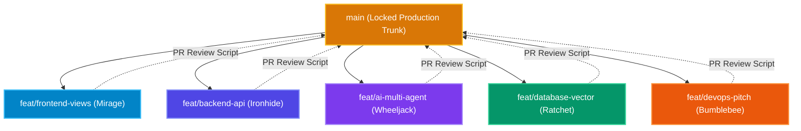

# 📋 Teammate Quick-Start Cheat Sheet & Pocket Guide
### *Zero Friction, Zero Guesswork: How Every Teammate Starts and Ships in 5 Minutes*

Welcome to the **Hackathon Strategy Framework (HSF)**! This guide is written so that **any teammate**—whether you are working on Frontend, Backend, AI, Database, Cloud, or Pitch—can clone this repository, start coding immediately, and never worry about breaking someone else's work.

---

## ⚡ The 60-Second Onboarding (Run This First)

Open your terminal and run:
```bash
# 1. Clone & Enter
git clone https://github.com/Sathvik1533/hackathon-strategy-framework.git
cd hackathon-strategy-framework

# 2. Launch Local Multi-Container Stack (FastAPI, Redis, Postgres 16, FastMCP)
./init.sh

# 3. Run the Interactive Teammate Wizard
python3 scripts/quickstart_wizard.py
```

The wizard will ask for your name and role, automatically create your dedicated git branch, assign your **Transformers Autobot Companion**, and write your custom AI IDE prompt to `.hsf/my_agent_prompt.md`.

---

## 👥 Role-by-Role Quick Reference Cards

### 🎨 1. Frontend & Real-Time UX Lead
* **Companion Autobot**: **Mirage 🎨✨ (Frontend Hologram Specialist)**
* **Your Git Branch**: `feat/frontend-views`
* **Your Target Layer**: Next.js 14 / HTML5 + Tailwind CSS + Real-Time SSE Listeners

| Question | Answer |
| :--- | :--- |
| **What 3 files do I edit?** | 1. `frontend/index.html` (or `mascot-dashboard/src/app/page.tsx`)<br/>2. `frontend/style.css` (Design tokens & theme)<br/>3. `frontend/app.js` (SSE stream integration) |
| **What commands do I run?** | `open frontend/index.html`<br/>*or for Next.js:* `cd mascot-dashboard && npm run dev` |
| **How do I pick an aesthetic?** | Run `npx hsf aesthetic` to inspect design tokens (Glassmorphic, Brutalist, Skeuomorphic). |
| **What should I NEVER touch?** | `backend/src/app/core/redis.py`, `database/supabase_rls.sql` *(prevents backend breaks)* |
| **How do I test my UI?** | Check that `First Contentful Paint < 0.8s` and zero layout shifts occur when receiving SSE events. |

---

### 🛡️ 2. Backend API & Resilience Lead
* **Companion Autobot**: **Ironhide 🛡️⚡ (Backend Titan & Resilience Sentinel)**
* **Your Git Branch**: `feat/backend-api`
* **Your Target Layer**: FastAPI 0.115+ + Redis Connection Pool + Circuit Breakers

| Question | Answer |
| :--- | :--- |
| **What 3 files do I edit?** | 1. `backend/src/app/api/v1/endpoints/` (Domain routes)<br/>2. `backend/src/app/core/redis.py` (Rate limiting & caching)<br/>3. `backend/tests/test_api.py` (API tests) |
| **What commands do I run?** | `PYTHONPATH=backend pytest` *(runs 17 unit tests in 0.08s)*<br/>`curl http://localhost:8000/api/v1/health` |
| **What is the API standard?** | Always wrap responses in `ResponseEnvelope[T]`: `{"success": true, "data": ...}`. |
| **What should I NEVER touch?** | `frontend/index.html`, `pitch/pitch.marp.md` |
| **How do I check circuit breakers?** | Visit `http://localhost:8000/api/v1/health/circuit-breakers` to view live state. |

---

### 🔬 3. AI Systems & Multi-Agent Lead
* **Companion Autobot**: **Wheeljack 🔬⚡ (AI & Multi-Agent Weaponsmith)**
* **Your Git Branch**: `feat/ai-multi-agent`
* **Your Target Layer**: LangGraph StateGraph + FastMCP SSE Tools + FlashRank Reranker

| Question | Answer |
| :--- | :--- |
| **What 3 files do I edit?** | 1. `ai_layer/langgraph_supervisor.py` (Cyclic supervisor & worker nodes)<br/>2. `ai_layer/fastmcp_server.py` (SSE tool server on port 8001)<br/>3. `ai_layer/flashrank_reranker.py` (CPU cross-encoder) |
| **What commands do I run?** | `python3 ai_layer/langgraph_supervisor.py` *(test agent flow)*<br/>`python3 ai_layer/eval_harness.py` *(run RAGAS test suite)* |
| **What safety gate must I keep?** | Keep `interrupt_before=["human_gate"]` before any database deletion or payment execution! |
| **What should I NEVER touch?** | `infra/docker-compose.yml`, `frontend/style.css` |
| **How do I add a new tool?** | Add the tool inside `ai_layer/fastmcp_server.py` using `@mcp.tool()`. |

---

### 💾 4. Database & Vector Search Lead
* **Companion Autobot**: **Ratchet 🏥💾 (Database & Security Guardian)**
* **Your Git Branch**: `feat/database-vector`
* **Your Target Layer**: PostgreSQL 16 + pgvector HNSW + Supabase RLS

| Question | Answer |
| :--- | :--- |
| **What 3 files do I edit?** | 1. `database/seed_data.py` (Seed entities & synthetic embeddings)<br/>2. `database/supabase_rls.sql` (Multi-tenant security policies)<br/>3. `ai_layer/hybrid_retriever.py` (HNSW dense + BM25 sparse RRF) |
| **What commands do I run?** | `python3 database/seed_data.py`<br/>`docker compose -f infra/docker-compose.yml exec db psql -U postgres` |
| **What is the vector index rule?** | Use HNSW index: `CREATE INDEX ON chunks USING hnsw (embedding vector_cosine_ops)`. |
| **What should I NEVER touch?** | `frontend/index.html`, `pitch/demo.sh` |
| **How do I verify RLS?** | Query with and without `auth.uid()` header to confirm tenant isolation. |

---

### 🚀 5. Cloud DevOps & Stage Pitch Lead
* **Companion Autobot**: **Bumblebee 🐝🚀 (Cloud DevOps & Stage Scout)**
* **Your Git Branch**: `feat/devops-pitch`
* **Your Target Layer**: Docker Multi-Stage + AWS ECS Fargate + Marp Pitch Slides

| Question | Answer |
| :--- | :--- |
| **What 3 files do I edit?** | 1. `pitch/pitch.marp.md` (6-minute pitch deck)<br/>2. `pitch/demo.sh` (Offline terminal demo backup)<br/>3. `infra/Dockerfile` & `infra/aws-ecs-task-definition.json` |
| **What commands do I run?** | `npx hsf pitch` *(compiles Marp to presentation.html)*<br/>`bash pitch/demo.sh` *(runs 30-second live colored demo)* |
| **What is the slide formula?** | Slide 1: Hook $\to$ Slide 2: Problem $\to$ Slide 3: Architecture $\to$ Slide 4: Demo $\to$ Slide 5: Metrics $\to$ Slide 6: ROI. |
| **What should I NEVER touch?** | `backend/src/app/core/`, `ai_layer/hybrid_retriever.py` |
| **How do I verify container size?** | Run `docker images hsf-core` to verify image is under 180MB. |

---

## 🛡️ The Zero-Conflict Git Protocol

To ensure 5 or 6 teammates can push code simultaneously with **zero git merge conflicts**:



1. **Strict File Ownership**: Every role edits *only* their assigned directory (Frontend leads edit `frontend/`, Backend leads edit `backend/`, etc.).
2. **Never Commit Directly to `main`**: Always work on your `feat/<role>` branch.
3. **Verify Before Pushing**:
   ```bash
   # Run tests and linter
   ruff check .
   PYTHONPATH=backend pytest
   
   # Run automated PR reviewer
   python3 scripts/review_pr.py
   ```
4. **Push with Confidence**: When ready, open a PR and merge to `main`.

---

## 🤖 How to Use AI IDEs (Antigravity / Cursor / Claude Code)

1. Open `.hsf/my_agent_prompt.md`.
2. Copy the entire file content.
3. Paste it as the initial system prompt in your AI IDE chat.
4. Your AI agent now understands:
   * Exactly who you are.
   * Which files it is allowed to touch.
   * Which files it must NEVER modify.
   * The exact test commands to run after each edit.

---

## 👓 How to Ask Senior Orbit for Advice

Orbit is your virtual Senior Principal Engineer. If you get stuck at 2:00 AM:

```bash
# Ask any architectural question:
python3 scripts/senior_companion.py --ask "How should I structure the Redis cache key for user sessions?"

# Or ask about error handling:
python3 scripts/senior_companion.py --ask "Why is my pgvector query taking longer than 20ms?"

# Or open interactive desk:
python3 scripts/senior_companion.py
```

---

## 🚨 Emergency: Conference Stage Wi-Fi Dies!

If the stage Wi-Fi crashes 30 seconds before your presentation:
1. **Do NOT panic or refresh the browser.**
2. Open your terminal and run:
   ```bash
   bash pitch/demo.sh
   ```
3. This runs a beautiful, colored, 100% offline terminal simulation demonstrating:
   * Health checks
   * Hybrid RAG query execution (<15ms)
   * Redis cache hit (<8ms)
   * LangGraph agent task approval
   * Zero external internet dependency.
4. Judges will award maximum points for enterprise reliability!

---

## 🎮 Cybernetic Arena & Teammate Leaderboard

HSF includes an interactive **Gamified Sprint Arena** to keep team energy and collaboration sky-high:

* **View Live Standings**:
  ```bash
  npx hsf leaderboard
  # Or open the live web arcade HUD:
  open frontend/leaderboard.html
  ```
* **Inspect & Claim 24h Quests (+100 to +500 XP)**:
  ```bash
  # View all 8 active sprint bounties
  npx hsf quest
  
  # Claim a completed quest (e.g., Ignition Sequence, Neural Strike, Eval Supremacy)
  npx hsf quest claim q-ignition --teammate "Backend Lead"
  ```
* **High-Five / Peer Cheer (+25 Synergy XP)**:
  ```bash
  # Send morale boosts to teammates when they ship or pass tests
  npx hsf cheer "Frontend Lead"
  ```

